# Kingfisher 视频编解码模块技术文档

本文档详细介绍 Kingfisher 项目中视频处理模块（`pkg/cv/video`）的架构设计、核心类、数据流和使用方式。

---

## 目录

1. [模块概述](#1-模块概述)
2. [整体架构](#2-整体架构)
3. [核心类设计](#3-核心类设计)
4. [数据流分析](#4-数据流分析)
5. [解码流程详解](#5-解码流程详解)
6. [编码流程详解](#6-编码流程详解)
7. [Filter 过滤器系统](#7-filter-过滤器系统)
8. [关键数据结构](#8-关键数据结构)
9. [使用示例](#9-使用示例)

---

## 1. 模块概述

### 1.1 功能特性

- **视频解码**：支持多种视频格式的解码（H.264、H.265、VP9 等）
- **视频编码**：支持重新编码输出
- **音频处理**：同步处理音频流
- **Filter 链**：支持视频/音频过滤器（缩放、旋转、裁剪等）
- **流复制**：支持无损流复制模式
- **批量读取**：支持按批次读取解码帧

### 1.2 文件结构

```
pkg/cv/video/
├── input_file.h/cc          # 输入文件处理（解码入口）
├── output_file.h/cc         # 输出文件处理（编码入口）
├── input_stream.h/cc        # 输入流管理
├── output_stream.h/cc       # 输出流管理
├── stream.h/cc              # 流基类
├── ffmpeg_filter.h/cc       # FilterGraph 管理
├── input_filter.h/cc        # 输入过滤器
├── output_filter.h/cc       # 输出过滤器
├── ffmpeg_types.h           # 数据类型定义
├── ffmpeg_utils.h/cc        # 工具函数
├── ffmpeg_error.h           # 错误处理
└── ffmpeg_hw.h/cc           # 硬件加速（预留）
```

---

## 2. 整体架构

### 2.1 架构图

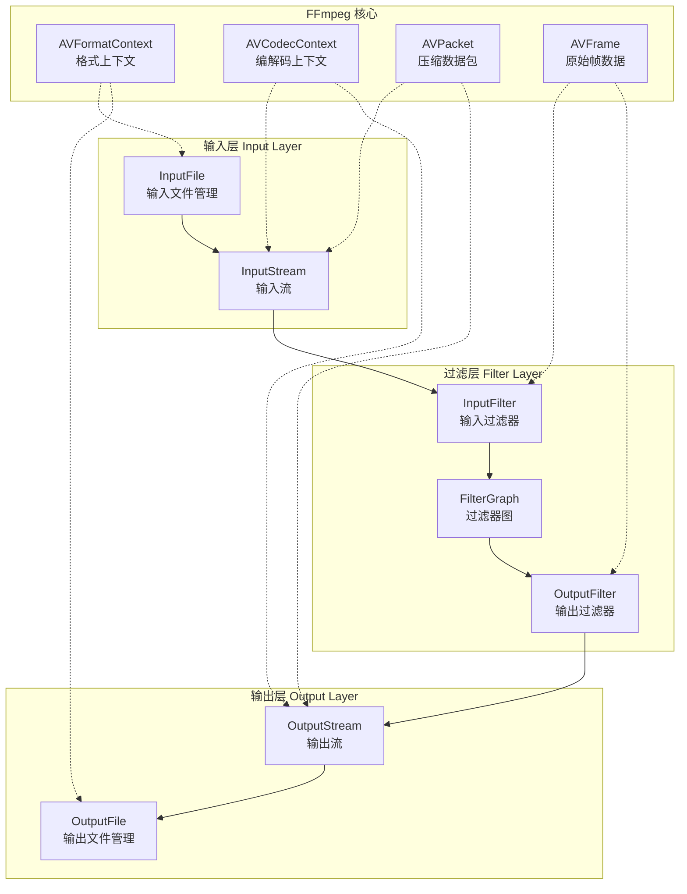

### 2.2 类继承关系

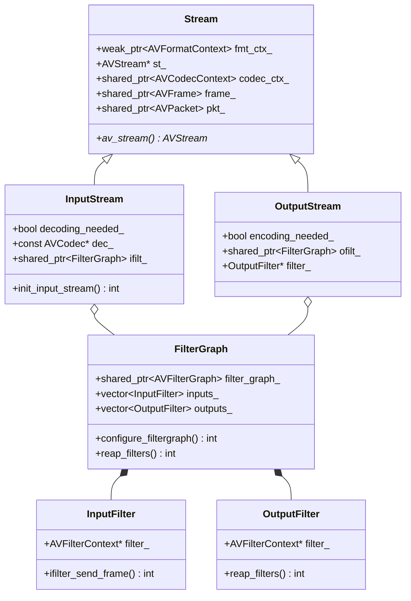

---

## 3. 核心类设计

### 3.1 InputFile - 输入文件管理

**职责**：打开输入文件、管理输入流、读取和解码数据包

```cpp
class InputFile {
public:
    // 打开输入文件
    int open(const std::string &filename, FormatContext &format_ctx);
    
    // 批量读取解码帧
    int read_frames(std::vector<Frame> &video_frames,
                    std::vector<Frame> &audio_frames, 
                    int32_t batch_size, bool &finished);

private:
    // 添加输入流
    int add_input_streams();
    // 选择解码器
    int choose_decoder(const std::shared_ptr<InputStream> &ist, const AVCodec *&codec);
    // 处理输入数据包
    int process_input_packet(const std::shared_ptr<InputStream> &ist, AVPacket *pkt, int no_eof);
    // 视频解码
    int decode_video(const std::shared_ptr<InputStream> &ist, AVPacket *pkt, int eof, 
                     bool &got_output, int64_t &duration_pts, bool &decode_failed);
    // 音频解码
    int decode_audio(const std::shared_ptr<InputStream> &ist, AVPacket *pkt,
                     bool &got_output, bool &decode_failed);
    // 初始化过滤器
    int init_filters();

public:
    std::shared_ptr<AVFormatContext> ifmt_ctx_;           // 输入格式上下文
    std::vector<std::shared_ptr<InputStream>> input_streams_; // 输入流列表
    std::string video_filter_spec_;  // 自定义视频过滤器
    std::string audio_filter_spec_;  // 自定义音频过滤器
};
```

### 3.2 OutputFile - 输出文件管理

**职责**：创建输出文件、管理输出流、编码和写入数据

```cpp
class OutputFile {
public:
    // 打开输出文件
    int open(const std::string &filename, FormatContext &format_ctx);
    // 写入帧数据
    int write_frames(const std::vector<Frame> &raw_frames);
    // 刷新缓冲区
    int flush();

private:
    // 创建输出流
    int create_streams(const FormatContext &format_ctx);
    // 选择编码器
    int choose_encoder(const std::shared_ptr<OutputStream> &ost, const AVCodec *&codec);
    // 初始化输出流编码
    int init_output_stream_encode(const std::shared_ptr<OutputStream> &ost, AVFrame *frame);
    // 编码帧
    int of_encode_frame(const std::shared_ptr<OutputStream> &ost, const std::shared_ptr<AVFrame> &frame);
    // 写入数据包
    int of_write_packet(const std::shared_ptr<OutputStream> &ost, AVPacket *pkt);

public:
    std::shared_ptr<AVFormatContext> ofmt_ctx_;           // 输出格式上下文
    std::vector<std::shared_ptr<OutputStream>> output_streams_; // 输出流列表
};
```

### 3.3 FilterGraph - 过滤器图

**职责**：管理 FFmpeg 过滤器链，处理视频/音频变换

```cpp
class FilterGraph : public std::enable_shared_from_this<FilterGraph> {
public:
    // 配置过滤器图
    int configure_filtergraph();
    // 初始化简单过滤器图
    int init_simple_filtergraph();
    // 发送帧到过滤器
    int send_frame_to_filters(const std::shared_ptr<AVFrame> &decoded_frame);
    // 收集过滤后的帧
    int reap_filters(std::vector<std::shared_ptr<AVFrame>> &filtered_frames, bool need_filtered_frames);
    // 发送 EOF
    int send_filter_eof(int64_t pts);

public:
    std::shared_ptr<AVFilterGraph> filter_graph_;
    std::vector<std::shared_ptr<InputFilter>> inputs_;
    std::vector<std::shared_ptr<OutputFilter>> outputs_;
    std::string graph_desc_;  // 过滤器描述字符串
};
```

---

## 4. 数据流分析

### 4.1 完整数据流图

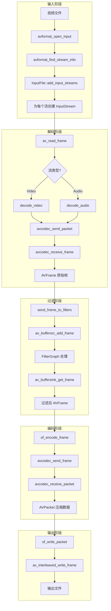

### 4.2 数据结构转换流程

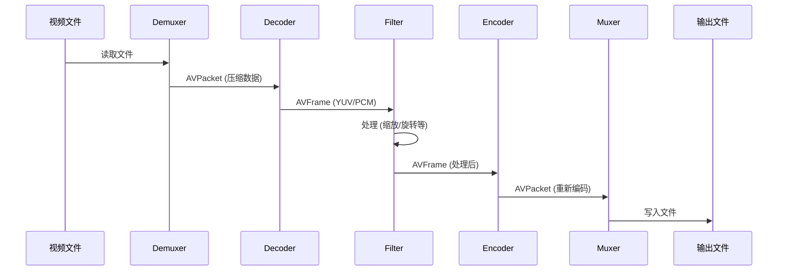

---

## 5. 解码流程详解

### 5.1 解码流程图

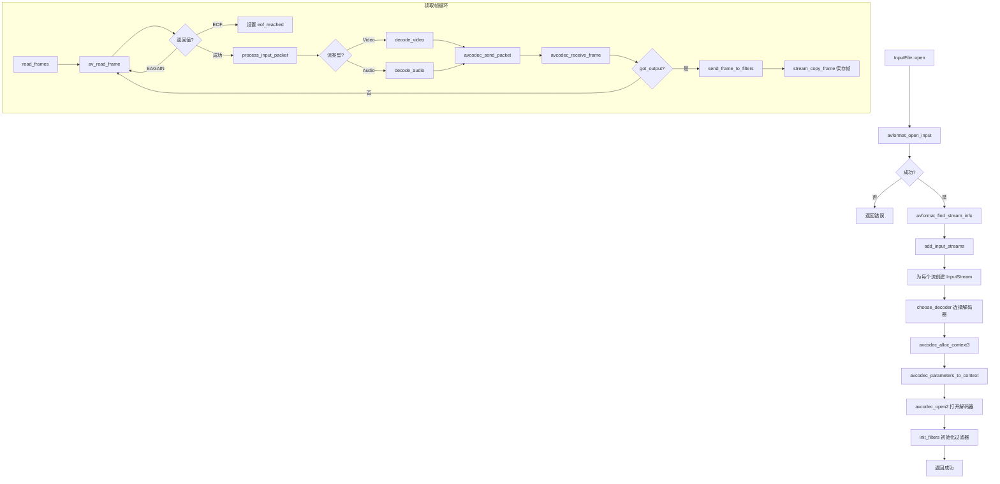

### 5.2 解码核心代码流程

```cpp
// 1. 打开输入文件
int InputFile::open(const std::string &filename, FormatContext &format_ctx) {
    // 分配 AVFormatContext
    AVFormatContext *ifmt_ctx = avformat_alloc_context();
    
    // 打开输入
    ret = avformat_open_input(&ifmt_ctx, filename.c_str(), ...);
    
    // 查找流信息
    ret = avformat_find_stream_info(ifmt_ctx_.get(), opts);
    
    // 添加输入流
    ret = add_input_streams();
    
    // 初始化过滤器
    ret = init_filters();
}

// 2. 读取和解码帧
int InputFile::read_frames(...) {
    while (!stop_waiting()) {
        // 读取压缩包
        ret = av_read_frame(ifmt_ctx_.get(), pkt_);
        
        // 处理数据包
        ret = process_input_packet(ist, pkt, true);
    }
}

// 3. 解码视频
int InputFile::decode_video(...) {
    // 发送数据包到解码器
    ret = decode(ist->codec_ctx_.get(), pkt, decoded_frame.get(), got_output);
    
    if (got_output) {
        // 设置时间基
        decoded_frame->time_base = st->time_base;
        
        // 发送到过滤器
        ret = send_frame_to_filters(ist, decoded_frame);
    }
}
```

---

## 6. 编码流程详解

### 6.1 编码流程图

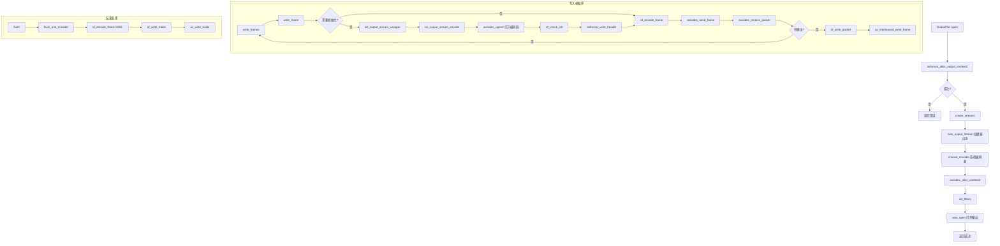

### 6.2 编码核心代码流程

```cpp
// 1. 打开输出文件
int OutputFile::open(const std::string &filename, FormatContext &format_ctx) {
    // 分配输出格式上下文
    avformat_alloc_output_context2(&ofmt_ctx, nullptr, nullptr, filename.c_str());
    
    // 创建输出流
    ret = create_streams(format_ctx);
    
    // 初始化过滤器
    ret = init_filters();
    
    // 打开输出 IO
    ret = avio_open(&ofmt_ctx_->pb, filename.c_str(), AVIO_FLAG_WRITE);
}

// 2. 写入帧
int OutputFile::write_frame(const Frame &raw_frame) {
    // 初始化输出流（首次）
    ret = init_output_stream_wrapper(ost, frame.get());
    
    // 编码并写入
    ret = of_encode_frame(ost, frame);
}

// 3. 编码帧
int OutputFile::of_encode_frame(...) {
    // 发送帧到编码器
    ret = avcodec_send_frame(enc_ctx, frame.get());
    
    while (1) {
        // 接收编码后的数据包
        ret = avcodec_receive_packet(enc_ctx, pkt.get());
        if (ret == AVERROR(EAGAIN) || ret == AVERROR_EOF) break;
        
        // 写入数据包
        ret = of_write_packet(ost, pkt.get());
    }
}

// 4. 刷新并关闭
int OutputFile::flush() {
    // 刷新编码器
    for (auto &ost : output_streams_) {
        ret = flush_one_encoder(i);
    }
    
    // 写入尾部
    ret = of_write_trailer();
}
```

---

## 7. Filter 过滤器系统

### 7.1 过滤器架构

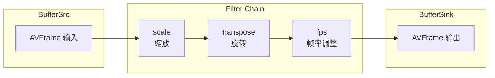

### 7.2 过滤器初始化流程

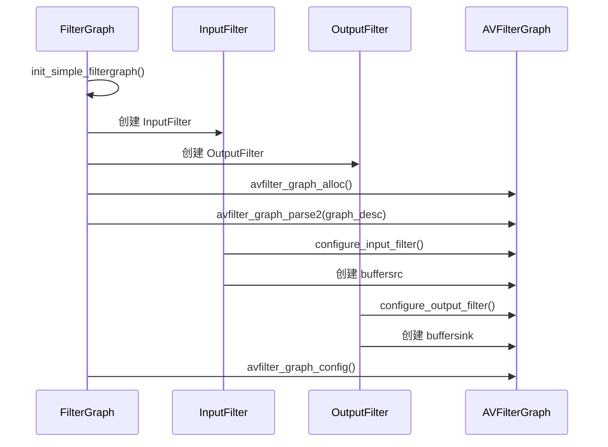

### 7.3 常用过滤器

| 过滤器 | 类型 | 说明 | 示例 |
|--------|------|------|------|
| `null` | 视频 | 视频直通 | `null` |
| `anull` | 音频 | 音频直通 | `anull` |
| `scale` | 视频 | 缩放 | `scale=1280:720` |
| `transpose` | 视频 | 旋转 | `transpose=1` (顺时针90°) |
| `fps` | 视频 | 帧率调整 | `fps=30` |
| `framestep` | 视频 | 跳帧 | `framestep=2` |
| `crop` | 视频 | 裁剪 | `crop=640:480:0:0` |
| `aresample` | 音频 | 重采样 | `aresample=44100` |
| `volume` | 音频 | 音量调节 | `volume=0.5` |

---

## 8. 关键数据结构

### 8.1 Frame 结构

```cpp
struct Frame {
    std::shared_ptr<AVPacket> packet;  // 压缩数据（流复制模式）
    std::shared_ptr<AVFrame> frame;    // 原始数据（解码模式）
    
    int64_t frame_number = 0;          // 帧序号
    AVRational time_base;              // 时间基
    int64_t pts = AV_NOPTS_VALUE;      // 显示时间戳
    AVMediaType codec_type;            // 媒体类型 (VIDEO/AUDIO)
    AVCodecID codec_id;                // 编解码器 ID
};
```

### 8.2 FormatContext 结构

```cpp
struct FormatContext {
    std::shared_ptr<AVFormatContext> av_format_context;  // FFmpeg 格式上下文
    AVStream* video_stream = nullptr;                     // 视频流
    std::shared_ptr<AVCodecContext> video_codec_context;  // 视频编解码上下文
    AVStream* audio_stream = nullptr;                     // 音频流
    std::shared_ptr<AVCodecContext> audio_codec_context;  // 音频编解码上下文
};
```

### 8.3 数据结构关系图

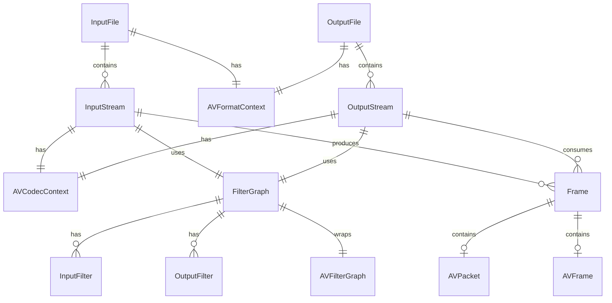

---

## 9. 使用示例

### 9.1 基本转码流程

```cpp
#include "cv/video/input_file.h"
#include "cv/video/output_file.h"

int transcode(const std::string &input_path, const std::string &output_path) {
    kingfisher::cv::InputFile input_file;
    kingfisher::cv::OutputFile output_file;
    kingfisher::cv::FormatContext format_ctx;

    // 1. 打开输入文件
    int ret = input_file.open(input_path, format_ctx);
    if (ret < 0) return ret;

    // 2. 打开输出文件
    ret = output_file.open(output_path, format_ctx);
    if (ret < 0) return ret;

    // 3. 读取并写入帧
    bool finished = false;
    while (!finished) {
        std::vector<kingfisher::cv::Frame> video_frames, audio_frames;
        
        ret = input_file.read_frames(video_frames, audio_frames, 10, finished);
        if (ret < 0) break;

        if (!video_frames.empty()) {
            ret = output_file.write_frames(video_frames);
            if (ret < 0) break;
        }
        if (!audio_frames.empty()) {
            ret = output_file.write_frames(audio_frames);
            if (ret < 0) break;
        }
    }

    // 4. 刷新输出
    output_file.flush();

    return ret;
}
```

### 9.2 使用自定义过滤器

```cpp
kingfisher::cv::InputFile input_file;

// 设置视频过滤器：缩放到 1280x720
input_file.video_filter_spec_ = "scale=1280:720";

// 设置音频过滤器：重采样到 44100Hz
input_file.audio_filter_spec_ = "aresample=44100";

// 组合多个过滤器
input_file.video_filter_spec_ = "scale=1280:720,transpose=1,fps=30";

// 打开文件
input_file.open(input_path, format_ctx);
```

### 9.3 流程时序图

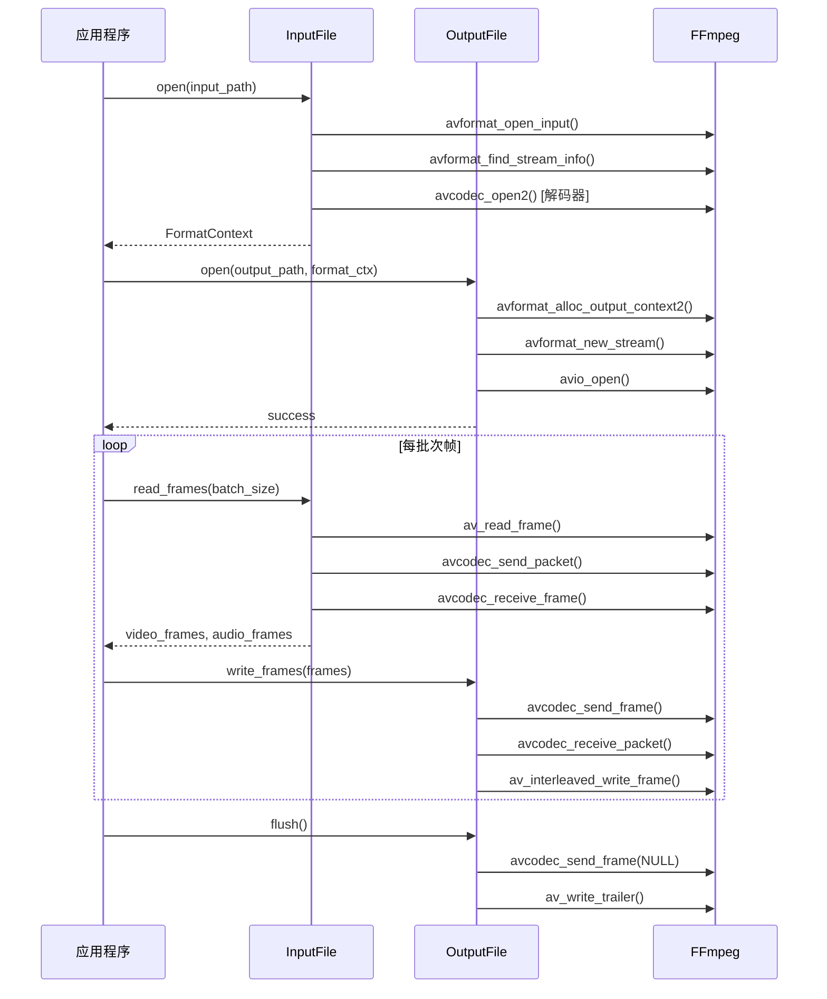

---

## 附录：状态机

### 解码器状态

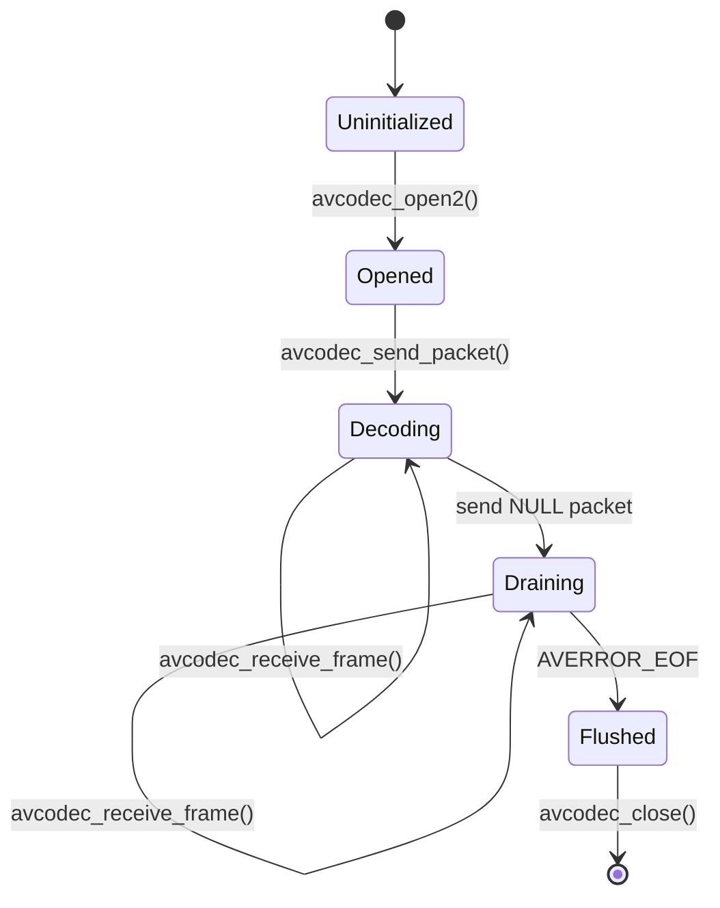

### 编码器状态

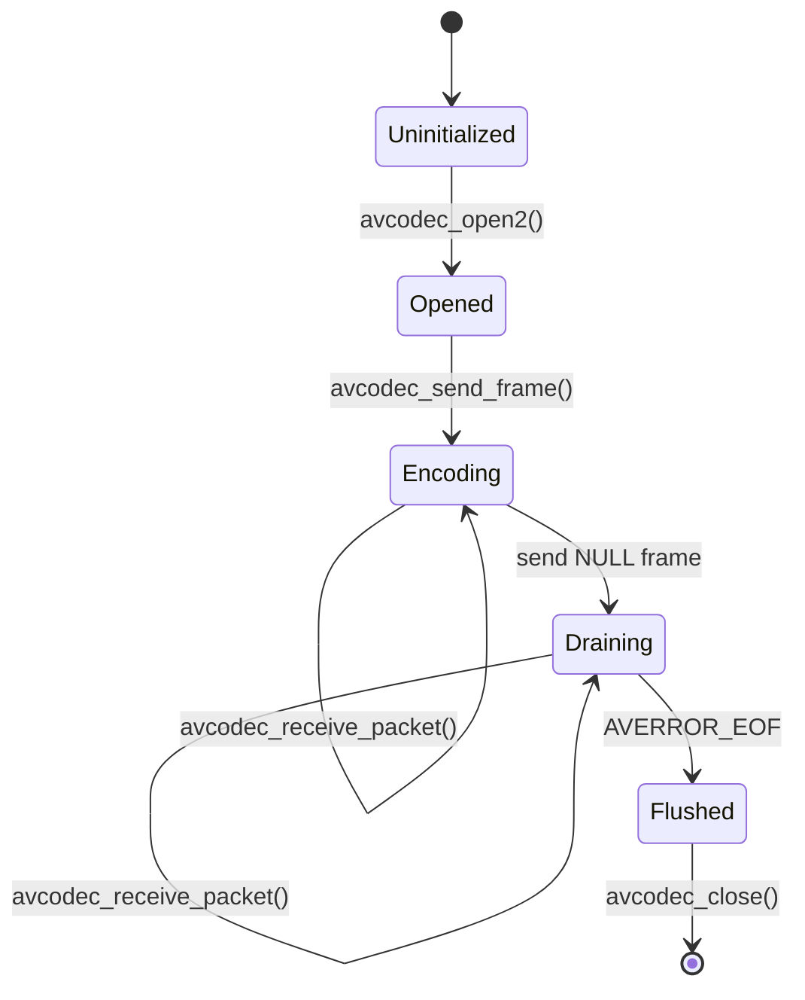

---

## 总结

Kingfisher 视频处理模块基于 FFmpeg 构建，提供了以下核心能力：

| 组件 | 职责 | 关键方法 |
|------|------|----------|
| `InputFile` | 输入文件管理、解码 | `open()`, `read_frames()` |
| `OutputFile` | 输出文件管理、编码 | `open()`, `write_frames()`, `flush()` |
| `InputStream` | 输入流状态管理 | `init_input_stream()` |
| `OutputStream` | 输出流状态管理 | 编码参数配置 |
| `FilterGraph` | 过滤器链管理 | `configure_filtergraph()`, `reap_filters()` |
| `Frame` | 统一帧数据封装 | 支持 AVPacket/AVFrame |

模块设计遵循 FFmpeg 官方 `ffmpeg.c` 的处理模式，同时进行了 C++ 封装和内存安全优化。
